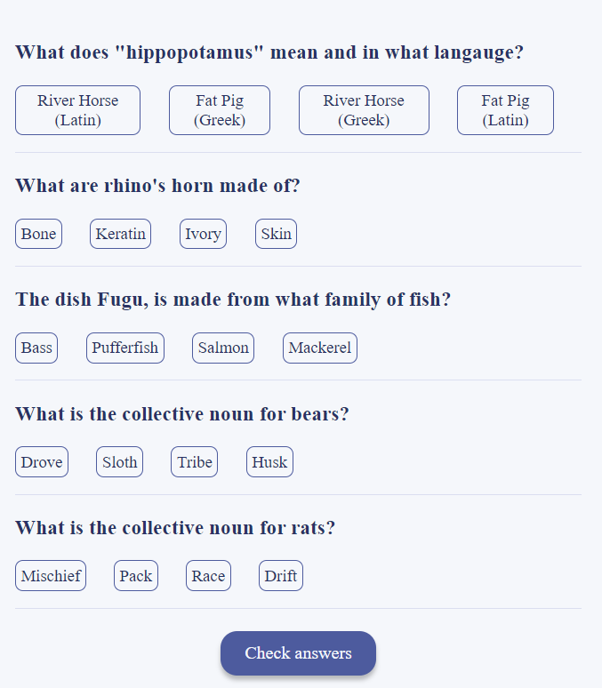
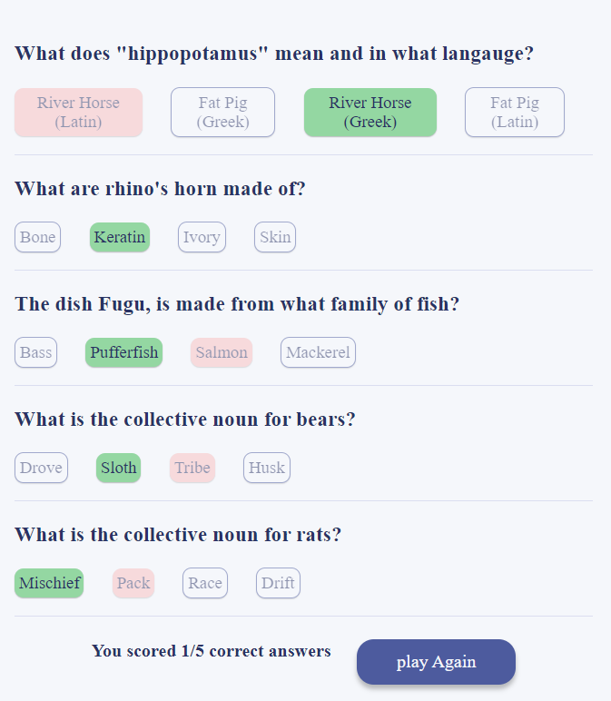

# Quizzical

Quizzical is a fun app that generates 5 random questions to test your general knowledge


## Screenshots





## Run Locally

Clone the project

```bash
  git clone https://github.com/Rishabh-D/Quizzical
```

Go to the project directory

```bash
  cd Quizzical
```

Install dependencies

```bash
  npm install
```

Start the server

```bash
  npm run start
```

## API Reference

## opentdb Api is used to fetch random trivia

##### base url : https://opentdb.com/api.php/

#### Get all items

```http
  GET ?amount=5&difficulty=medium&type=multiple
```

| Parameter    | Type     | Description                           |
| :----------- | :------- | :------------------------------------ |
| `amount`     | `int`    | **Required**. number of questions     |
| `difficulty` | `string` | **Required**. easy/ medium/ hard      |
| `type`       | `string` | **Required**. multiple or true/ false |
